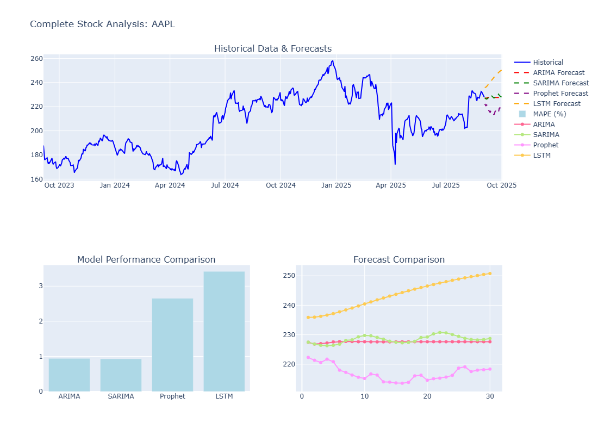

# 📈 StockTrack Analytics: Stock Market Forecasting Dashboard

A dynamic, interactive Streamlit dashboard designed to analyze historical stock data, forecast future prices using ARIMA, SARIMA, Prophet, and LSTM models, and provide actionable insights for financial analysis.

---

## 🎯 Short Description / Purpose

The **StockTrack Analytics Dashboard** is a powerful tool for investors and financial analysts to predict stock prices. It fetches historical stock data, applies advanced time series forecasting models, and presents results through interactive charts and a comprehensive report, enabling data-driven investment decisions.

---

## ⚙️ Tech Stack

This dashboard leverages the following technologies:

- **Python**: Core programming language for data processing and model implementation.
- **yfinance**: Library for fetching historical stock data from Yahoo Finance.
- **Streamlit**: Framework for building the interactive web-based dashboard.
- **Plotly**: Library for creating interactive visualizations.
- **Statsmodels**: Implements ARIMA and SARIMA models for time series forecasting.
- **Prophet**: Facebook’s time series forecasting library for robust predictions.
- **TensorFlow**: Used for building and training the LSTM neural network.
- **Scikit-learn**: Provides utilities for data preprocessing and metrics calculation.
- **ngrok**: Enables public URL access for running the dashboard in Google Colab.

---

## 📊 Data Source

The dashboard utilizes data from:

- **Yahoo Finance (via yfinance)**: Historical stock data including closing prices and volume for any valid stock ticker (e.g., `AAPL` for Apple).

### Data Fields

- **Close Price**: Primary metric for forecasting.
- **Volume**: Analyzed for technical indicators.
- **Date Range**: User-selectable (e.g., 1 year, 2 years, 5 years, or max).

> 💾 Data is fetched in real-time using the yfinance library and processed within the Streamlit app.

---

## 🌟 Features / Highlights

### Business Problem

Stock price forecasting is challenging due to market volatility and the need for accurate, centralized analysis tools.

### Goal of the Dashboard

To provide a single, interactive dashboard that fetches historical stock data, trains multiple forecasting models, evaluates their performance, and visualizes predictions for informed investment decisions.

### Key Visuals

- **Historical Stock Prices**: Displays closing prices over the selected period.
- **Forecast Plots**: Overlays predictions from ARIMA, SARIMA, Prophet, and LSTM models.
- **Model Performance**: Bar chart comparing Mean Absolute Percentage Error (MAPE) across models.
- **Forecast Comparison**: Line chart showing predicted price trends for each model.
- **Time Series Analysis**: Stationarity test results (ADF) and seasonal decomposition (if applicable).

### Business Impact & Insights

- **Accurate Forecasting**: Combines multiple models for robust stock price predictions.
- **Performance Evaluation**: Compares model accuracy using MAPE and RMSE metrics.
- **Interactive Analysis**: Allows customization of stock symbols, periods, and forecast horizons.
- **Decision Support**: Provides insights into price trends, volatility, and volume for investment planning.

---

## 📸 Dashboard Preview

> **Note:** Ensure the `stock_dashboard.png` file is uploaded to the `images` folder in your GitHub repository for the preview image to display correctly.

---

## 📌 Future Improvements

- **Additional Models**: Incorporate GARCH or Transformer-based models for enhanced forecasting.
- **Real-Time Data**: Integrate live stock data feeds via APIs.
- **Portfolio Analysis**: Support analysis of multiple stocks simultaneously.
- **Cloud Deployment**: Deploy on Heroku or AWS for broader accessibility.
- **Custom Parameters**: Allow users to adjust ARIMA/SARIMA orders and LSTM architecture.

---

## 🙌 Acknowledgements

- Built using Python, Streamlit, and Plotly for powerful data analysis and visualization.
- Thanks to the open-source community for libraries like yfinance, prophet, and tensorflow.
- Inspired by the need for accessible, data-driven tools for financial analysis.

---

## ⚠️ Disclaimer

This dashboard is for educational purposes only. Stock market predictions are inherently uncertain, and past performance does not guarantee future results. Always consult with financial professionals before making investment decisions.
